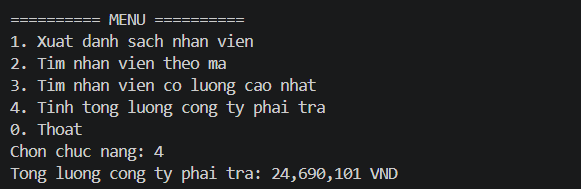
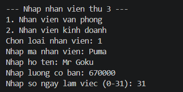
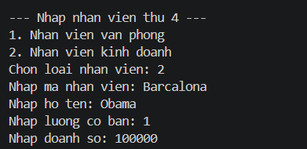
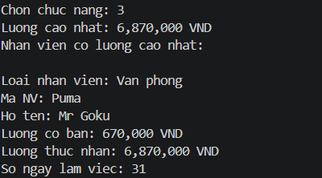

# BTLOP - Quản lý nhân viên bằng Console C#
Project console C# quản lý danh sách nhân viên, áp dụng các kiến thức:

- Class, property, constructor
- Encapsulation
- Kế thừa
- Đa hình thông qua `virtual` và `override`
- Quản lý danh sách bằng `List<NhanVien>`

## Yêu cầu
Chương trình cho phép nhập ít nhất 5 nhân viên thuộc 2 loại:
- Nhân viên văn phòng
- Nhân viên kinh doanh

Sau khi nhập danh sách, chương trình hiển thị menu:

<p align="center">
  
</p>

## Cấu trúc lớp
### `NhanVien`
Lớp cha chứa thông tin chung:
- Mã nhân viên
- Họ tên
- Lương cơ bản
<p align="center">
  
</p>

Các phương thức chính:
- `virtual double TinhLuong()`
- `virtual void HienThiThongTin()`

### `NhanVienVanPhong`
Kế thừa từ `NhanVien`.
Thông tin bổ sung:
- Số ngày làm việc, từ 0 đến 31
Công thức tính lương:

```text
Lương = Lương cơ bản + Số ngày làm việc * 200000
```

### `NhanVienKinhDoanh`
Kế thừa từ `NhanVien`.

Thông tin bổ sung:
- Doanh số, lớn hơn hoặc bằng 0
Công thức tính lương:
```text
Lương = Lương cơ bản + 5% * Doanh số
```
<p align="center">
  
</p>

## Tính đa hình
Danh sách nhân viên được khai báo dưới dạng:

```csharp
List<NhanVien> danhSach = new();
```

Khi xuất thông tin, tìm nhân viên lương cao nhất và tính tổng lương, chương trình gọi trực tiếp:

```csharp
nhanVien.HienThiThongTin();
nhanVien.TinhLuong();
```
<p align="center">
  
</p>
<p align="center">
  
</p>

Nhờ đa hình, mỗi loại nhân viên sẽ tự dùng cách hiển thị và cách tính lương riêng mà không cần kiểm tra kiểu nhân viên trong các chức năng xử lý.

## Cách chạy project
Mở terminal tại thư mục repo hoặc chạy trực tiếp lệnh:
dotnet run


