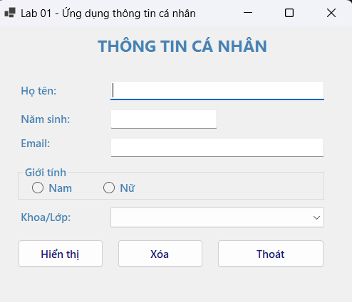
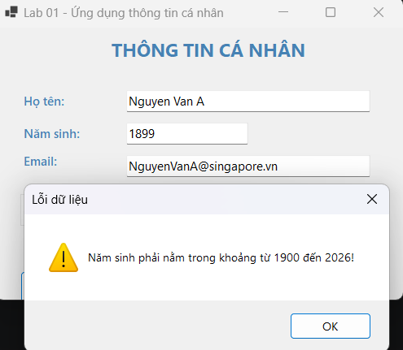
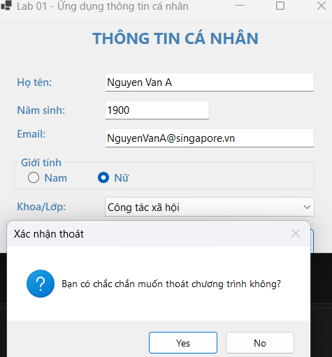

# Lab 01 - Ứng dụng thông tin cá nhân

Ứng dụng WinForms dùng để nhập, kiểm tra và hiển thị thông tin cá nhân của sinh viên.

## Thông tin bài lab
- Môn học: Lập trình Windows
- Công nghệ: C# WinForms
- Framework: .NET 10
- Project: `Lab01_Ungdungthongtincanhan`

## Chức năng chính

- Nhập họ tên sinh viên.
- Nhập năm sinh và tự động tính tuổi.
- Nhập email.
- Chọn giới tính Nam hoặc Nữ.
- Chọn khoa/lớp từ danh sách có sẵn.
- Hiển thị thông tin đã nhập bằng hộp thoại `MessageBox`.
- Xóa toàn bộ dữ liệu trên form.
- Thoát chương trình có xác nhận.

## Kiểm tra dữ liệu

- Họ tên không được để trống.
- Năm sinh không được để trống.
- Năm sinh phải là số nguyên.
- Năm sinh phải nằm trong khoảng từ `1900` đến năm hiện tại.
- Email không được để trống.
- Email phải đúng định dạng, ví dụ `ten@example.com`.
- Người dùng phải chọn giới tính.
- Người dùng phải chọn khoa/lớp.

## Hộp thư xác nhận



## Cách chạy

1. Cách chạy bằng VS Code / Terminal
Mở Terminal tại folder chứa file và chạy:
dotnet restore
dotnet build
dotnet run

2. Hoặc trong Visual Studio:
Mở file `Lab01.csproj`.
Chạy project Console App.

## Ghi chú 
Project sử dụng target framework:

```xml
<TargetFramework>net10.0-windows</TargetFramework>
<UseWindowsForms>true</UseWindowsForms>
```
