# LAB 02 - C# cơ bản: Quản lý mảng số nguyên bằng Console
## 1. Thông tin
- Học phần: COMP1019 - Lập trình Windows
- Buổi: 2 - C# cơ bản
- Lab: 02
- Loại project: Console App C#
- Target framework: .NET 10

## 2. Nội dung
Chương trình quản lý một mảng số nguyên bằng menu. Sau khi thực hiện xong một chức năng, chương trình quay lại menu cho đến khi người dùng chọn 0 - Thoát.

## 3. Chức năng

  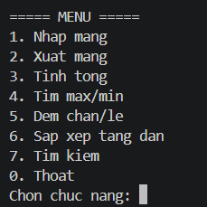

1. Nhập mảng
   - Nhập số lượng phần tử `n`.
   - `n` phải là số nguyên dương.
   - Nhập các phần tử số nguyên của mảng.

2. Xuất mảng
   - In toàn bộ phần tử trong mảng.

3. Tính tổng
   - Tính và in tổng các phần tử.

4. Tìm lớn nhất và nhỏ nhất
   - Tìm và in giá trị lớn nhất.
   - Tìm và in giá trị nhỏ nhất.

5. Đếm chẵn/lẻ
   - Đếm số phần tử chẵn.
   - Đếm số phần tử lẻ.

6. Sắp xếp tăng dần
   - Sắp xếp mang theo thứ tự tăng dần.
   - In mảng sau khi sắp xếp.

7. Tìm kiếm
   - Nhập giá trị `x`.
   - Kiểm tra `x` có xuất hiện trong mảng hay không.
   - Nếu có, in vị trí xuất hiện đầu tiên, tính từ 0.

0. Thoát
   - Kết thúc chương trình.

## 4. Yêu cầu kỹ thuật 
- Không viết toàn bộ chương trình trong `Main`.
- Tách các xử lý thành các phuong thức riêng.
- Có kiểm tra dữ liệu khi nhập số nguyên.
- Có kiểm tra `n` phải là số nguyên dương.
- Có kiểm tra lựa chọn menu.
- Không cho xử lý các chức năng khi chưa nhập mảng.
- Không bị dừng bất thường khi nhập sai lựa chọn menu.
- Tên biến và tên phương thức rõ nghĩa.

## 5. Cách chạy bằng VS Code / Terminal
1. Cách chạy bằng VS Code / Terminal
Mở Terminal tại folder chứa file và chạy:
dotnet restore
dotnet build
dotnet run

2. Hoặc trong Visual Studio:
Mở file `Lab02.csproj`.
Chạy project Console App.

## 6. Dữ liệu kiểm thử
### Test 1
- Nhap: n = 5; 4 1 9 2 7

  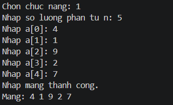

Ket qua can kiem tra:
- Tong = 23

  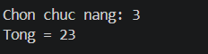

- Max = 9; Min = 1

  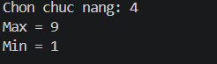

- So phan tu chan = 2; So phan tu le = 3

  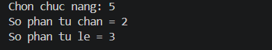

- Tim `x = 9` -> vi tri dau tien `2`.

  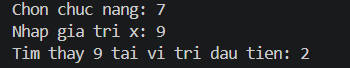

- Tim `x = 5` -> khong tim thay.

  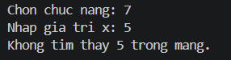

### Test 2
- Nhap: n = 4; -3 0 8 -1

  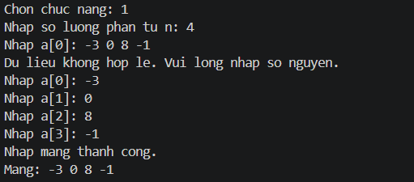

Ket qua can kiem tra:
- Tong = 4

  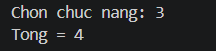

- Max = 8; Min = -3

  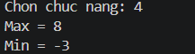

- So phan tu chan = 2; So phan tu le = 2

  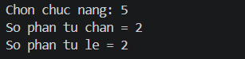

### Test 3 - dữ liệu sai
- Nhap `n = 0` -> Ket thuc chuong trinh.

  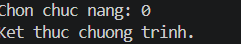

- Nhap `n` am -> yeu cau nhap lai

  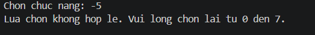

- Nhap chu thay vi so nguyen -> yeu cau nhap lai.

  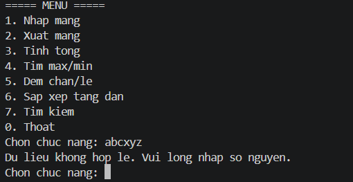

- Chon menu ngoai khoang `0..7` -> thong bao loi va quay lai menu.

  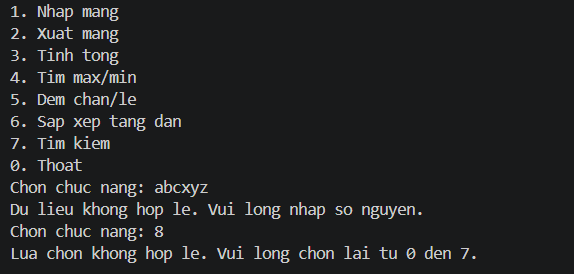

- Chon chuc nang truoc khi nhap mang -> thong bao chua nhap mang va quay lai menu.

  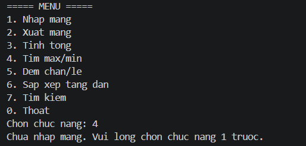

## 7. Ghi chú
Vị trí tìm kiếm được tính từ `0`, phù hợp với đề bài.
