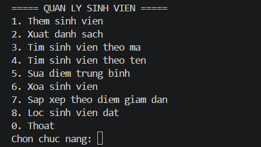
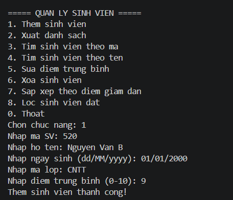
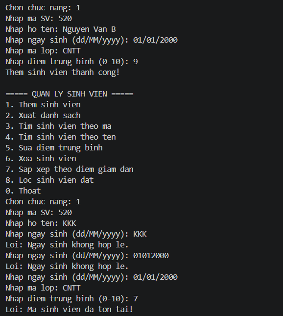
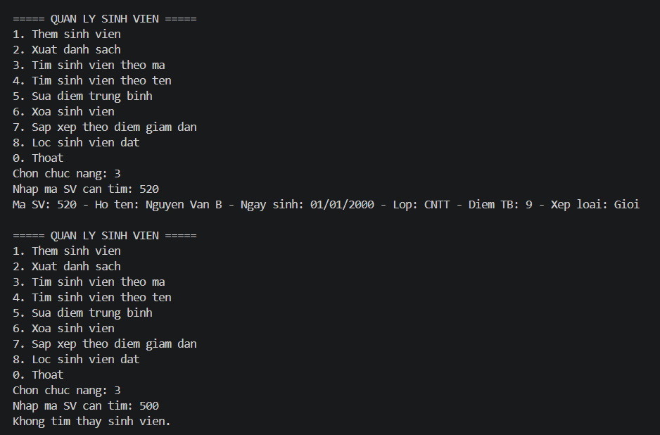
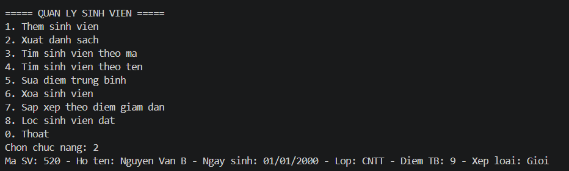
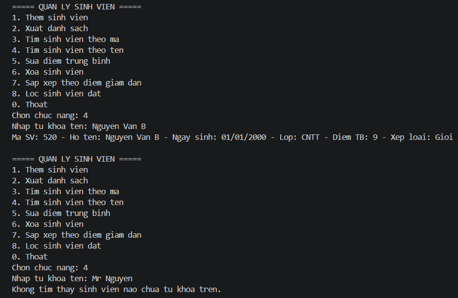
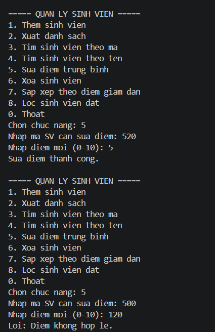
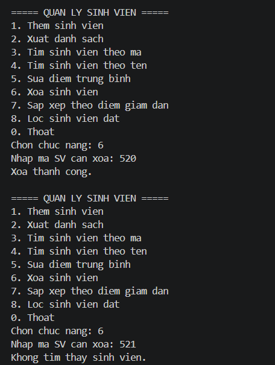
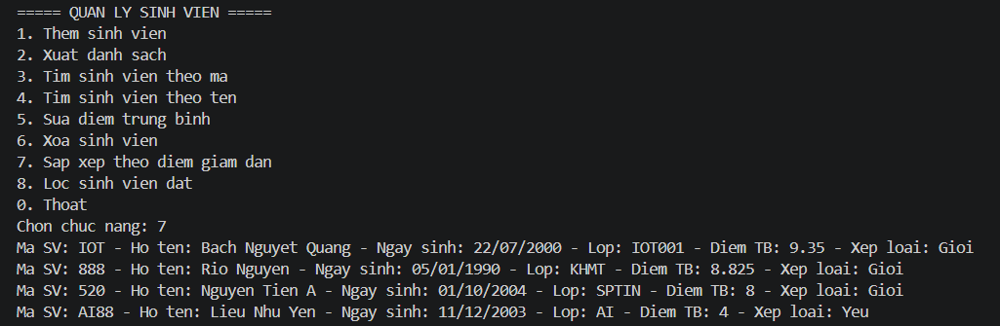
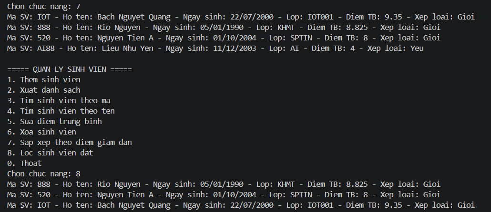

# Lab 03 - Quản lý sinh viên bằng Console 

## Thông tin

- Học phần: COMP1019 - Lập trình Windows
- Buổi: 2 - C# cơ bản
- Lab: 02
- Loại project: Console App C#
- Target framework: .NET 10

## Mô tả

Chương trình Console viết bằng C# theo hướng đối tượng, cho phép quản lý danh sách sinh viên (`List<SinhVien>`) thông qua menu. Dữ liệu được lưu tạm trong bộ nhớ khi chương trình đang chạy (chưa dùng cơ sở dữ liệu).

Chương trình vận dụng:

- Class, object, property và constructor.
- Kế thừa: `SinhVien` kế thừa từ `Nguoi`.
- `List<SinhVien>` để quản lý danh sách, được đóng gói trong lớp
  `QuanLySinhVien`, `Program`/`Main` không thao tác trực tiếp lên danh sách.
- LINQ cơ bản để tìm kiếm, lọc và sắp xếp dữ liệu.

## Chức năng

- Thêm sinh viên (kiểm tra mã sinh viên không được trùng).
- Xuất danh sách sinh viên.
- Tìm sinh viên theo mã.
- Tìm sinh viên theo tên (theo từ khóa, LINQ).
- Sửa điểm trung bình theo mã sinh viên.
- Xóa sinh viên theo mã.
- Sắp xếp danh sách theo điểm giảm dần (LINQ).
- Lọc sinh viên đạt (điểm trung bình >= 5) (LINQ).
- Thoát chương trình.

## Công nghệ sử dụng

- Ngôn ngữ: C#
- Nền tảng: .NET 10 (Console App)

## Cách chạy

1. Cách chạy bằng VS Code / Terminal
Mở Terminal tại folder chứa file và chạy:
dotnet restore
dotnet build
dotnet run

2. Hoặc trong Visual Studio:
Mở file `Lab03.csproj`.
Chạy project Console App.

## Hình ảnh minh họa

### Menu chính

  

### Thêm sinh viên thành công

  

### Thêm sinh viên với mã đã tồn tại

  

### Kiểm tra dữ liệu điểm nhập vào (âm, lớn hơn 10, hợp lệ)

  

### Xuất danh sách sinh viên

  

### Tìm sinh viên theo mã và không tồn tại

  

### Tìm sinh viên theo tên và không tồn tại

  

### Sửa điểm trung bình

  

### Xóa sinh viên với mã không tồn tại

  

### Sắp xếp theo điểm giảm dần

  

### Lọc sinh viên đạt (điểm >= 5)

  

