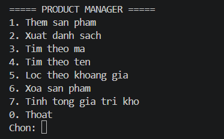
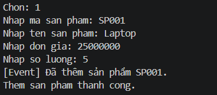
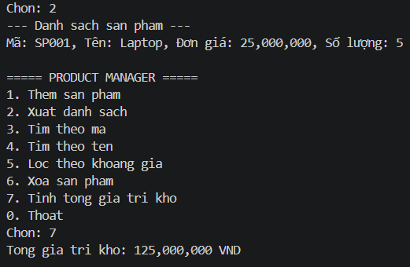
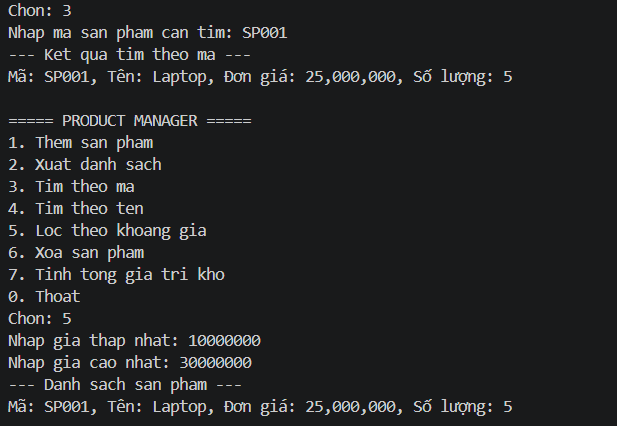
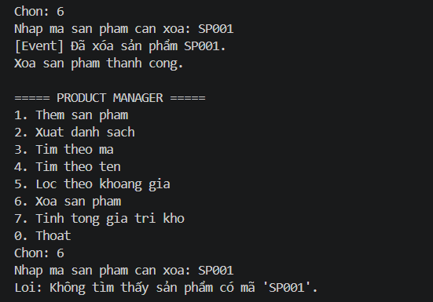
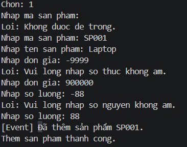
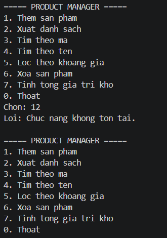

# Lab 04 - Quản lý sản phẩm bằng Console

## Thông tin

- Học phần: COMP1019 - Lập trình Windows
- Buổi: 4 - Exception, Delegate/Event, Func/Action và Generic trong C#
- Lab: 04
- Loại project: Console App C#
- Target framework: .NET 10

## Mô tả

Chương trình Console quản lý sản phẩm theo hướng đối tượng bằng C#. Dữ liệu được lưu tạm trong bộ nhớ trong quá trình chạy chương trình, không sử dụng cơ sở dữ liệu. Ứng dụng áp dụng các khái niệm:

- `try-catch` và `throw` để xử lý lỗi.
- Exception tự tạo để báo lỗi nghiệp vụ.
- `Generic Repository<T>` để quản lý danh sách dữ liệu chung.
- `Event` để thông báo khi thêm hoặc xóa sản phẩm thành công.
- `Func<Product, bool>` để lọc dữ liệu theo điều kiện.
- Tách logic xử lý thành các lớp riêng để tránh viết toàn bộ trong `Main`.

## Chức năng

  

1. Thêm sản phẩm
   - Nhập mã sản phẩm, tên, đơn giá và số lượng.
   - Mã sản phẩm không được rỗng và không được trùng.
   - Đơn giá và số lượng không được âm.

2. Xuất danh sách
   - Hiển thị toàn bộ sản phẩm hiện có trong kho.
   - Nếu danh sách rỗng, thông báo phù hợp.

3. Tìm theo mã
   - Nhập mã sản phẩm cần tìm.
   - Hiển thị thông tin chi tiết nếu tìm thấy.

4. Tìm theo tên
   - Nhập từ khóa tên sản phẩm.
   - In các sản phẩm có tên chứa từ khóa.

5. Lọc theo khoảng giá
   - Nhập giá nhỏ nhất và lớn nhất.
   - Dùng `Func<Product, bool>` để lọc.

6. Xóa sản phẩm
   - Nhập mã sản phẩm cần xóa.
   - Nếu sản phẩm tồn tại thì xóa và phát event thông báo.

7. Tính tổng giá trị kho
   - Tính tổng = đơn giá * số lượng của tất cả sản phẩm.

0. Thoát
   - Kết thúc chương trình.

## Yêu cầu kỹ thuật

- Không để chương trình dừng đột ngột khi người dùng nhập sai dữ liệu.
- Có ít nhất 2 exception tự tạo (`DuplicateProductException`, `ProductNotFoundException`).
- Có generic class `Repository<T>` với ràng buộc `where T : IEntity`.
- Có event khi thêm và xóa sản phẩm thành công.
- Sử dụng `Func<Product, bool>` trong chức năng lọc hoặc tìm kiếm.
- Không viết toàn bộ logic trong `Main`.
- Tên biến, tên hàm, tên class phải rõ nghĩa.
- Có kiểm tra dữ liệu đầu vào, tránh nhập mã rỗng, giá âm hoặc số lượng âm.

## Cách chạy

1. Cách chạy bằng VS Code / Terminal
Mở Terminal tại folder chứa project và chạy:

dotnet restore
dotnet build
dotnet run

2. Hoặc trong Visual Studio:
Mở file `Lab04_QuanLySanPham.csproj` hoặc file `.sln`.
Chạy project Console App.

## Dữ liệu kiểm thử

### Test 1 - Thêm sản phẩm thành công
- Nhập: 1
  - Mã: `SP001`
  - Tên: `Laptop`
  - Đơn giá: `25000000`
  - Số lượng: `5`

  

Kết quả:
- Thêm thành công.
- Event hiển thị thông báo: `Đã thêm sản phẩm SP001.`

### Test 2 - Xuất danh sách và tính tổng giá trị kho
- Sau khi thêm sản phẩm, chọn chức năng xuất danh sách.
- Sau đó chọn chức năng tính tổng giá trị kho.

  

Kết quả:
- In ra thông tin sản phẩm trong kho.
- Tổng giá trị kho = `25,000,000 * 5 = 125,000,000`.

### Test 3 - Tìm theo mã và lọc theo khoảng giá
- Tìm theo mã: `SP001`
- Lọc theo khoảng giá: ví dụ từ `10000000` đến `30000000`

  

Kết quả:
- Tìm thấy đúng sản phẩm.
- Lọc trả về sản phẩm phù hợp với khoảng giá.

### Test 4 - Xóa sản phẩm và lỗi nghiệp vụ
- Chọn xóa sản phẩm `SP001`.
- Sau đó thử xóa lại hoặc xóa mã không tồn tại.

  

Kết quả:
- Xóa thành công nếu mã tồn tại.
- Nếu không tồn tại, hiển thị exception tự tạo `ProductNotFoundException`.

### Test 5 - Kiểm tra dữ liệu sai
- Mã sản phẩm rỗng.
- Đơn giá âm.
- Số lượng âm.
- Mã sản phẩm trùng.
- Chọn menu không hợp lệ.

  

  

Kết quả:
- Không làm chương trình bị dừng bất thường.
- Hiển thị thông báo lỗi rõ ràng và quay lại menu.

