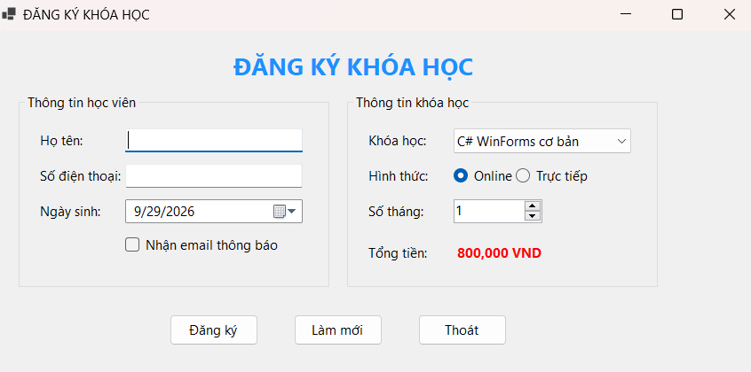
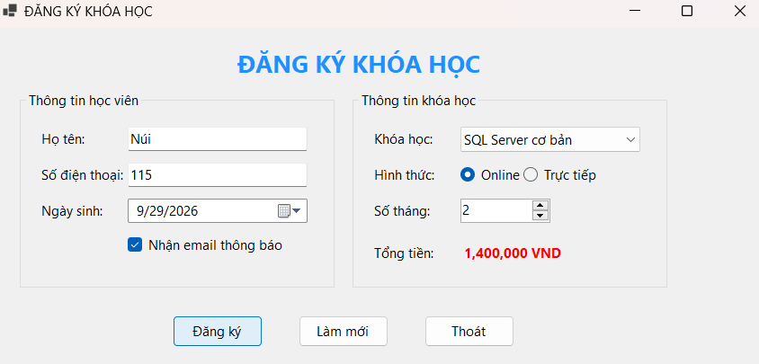
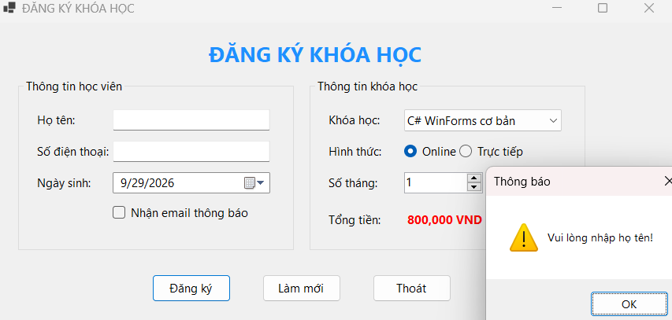
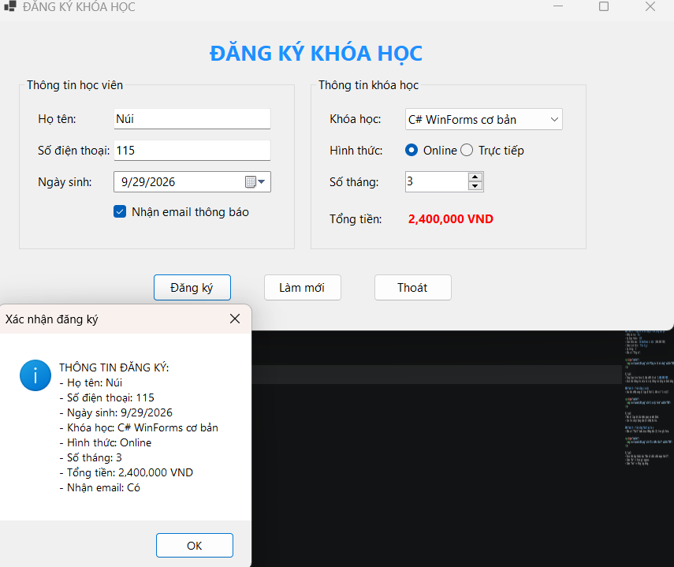
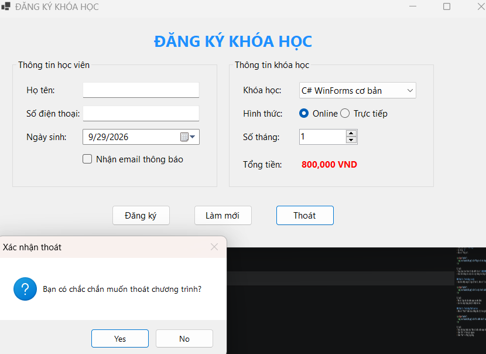

# Lab 05 - Ứng dụng Đăng ký khóa học (WinForms)

## Thông tin

- Học phần: COMP1019 - Lập trình Windows
- Buổi: 5 - Windows Forms cơ bản
- Lab: 05
- Loại project: Windows Forms App C#
- Target framework: .NET 10.0

## Mô tả

Chương trình `CourseRegistrationApp` là một ứng dụng giao diện trực quan (GUI) được xây dựng bằng Windows Forms. Ứng dụng mô phỏng chức năng đăng ký khóa học ngắn hạn, xử lý dữ liệu trực tiếp trên Form (không sử dụng cơ sở dữ liệu). Ứng dụng áp dụng các kỹ năng cơ bản:

- Thiết kế giao diện bằng Form Designer, Toolbox và Properties.
- Sử dụng các control cơ bản: `Label`, `TextBox`, `Button`, `ComboBox`, `RadioButton`, `CheckBox`, `DateTimePicker`, `NumericUpDown`, `GroupBox`.
- Đặt tên control đúng chuẩn quy ước (VD: `txtHoTen`, `btnDangKy`).
- Bắt và xử lý các sự kiện: `Load`, `Click`, `SelectedIndexChanged`, `ValueChanged`.
- Kiểm tra tính hợp lệ của dữ liệu đầu vào (Validation) và hiển thị kết quả bằng `MessageBox`.

## Chức năng

<p align="center">
  
</p>

1. Khởi động ứng dụng (Form Load)
   - Tự động nạp danh sách các khóa học vào ComboBox.
   - Chọn mặc định khóa học đầu tiên và hình thức học "Online".
   - Thiết lập số tháng học mặc định là 1 (tối thiểu 1, tối đa 12).
   - Hiển thị sẵn tổng học phí ban đầu.

2. Nút Đăng ký
   - Kiểm tra dữ liệu: Yêu cầu không được bỏ trống "Họ tên" và "Số điện thoại". Phải chọn một khóa học.
   - Tự động tính: `Tổng tiền = Học phí 1 tháng x Số tháng`.
   - Hiển thị một MessageBox tổng hợp toàn bộ thông tin phiếu đăng ký (bao gồm trạng thái nhận email).

3. Nút Làm mới
   - Xóa rỗng các ô nhập liệu (Họ tên, SĐT).
   - Đưa ngày sinh về ngày hiện tại.
   - Hủy chọn ô nhận email thông báo.
   - Trả ComboBox, RadioButton và NumericUpDown về giá trị mặc định ban đầu.
   - Đưa con trỏ (Focus) về lại ô "Họ tên".

4. Nút Thoát
   - Hiển thị hộp thoại (MessageBox) yêu cầu người dùng xác nhận.
   - Chỉ đóng ứng dụng nếu người dùng chọn "Yes".

## Yêu cầu kỹ thuật

- Sử dụng ít nhất 2 `GroupBox` để gom nhóm "Thông tin học viên" và "Thông tin khóa học".
- Bố cục căn lề rõ ràng, các control đặt ngay ngắn, cùng hàng/cùng khu vực.
- Tên control không được để mặc định (textBox1, button1...) mà phải đặt theo tiền tố (txt, cbo, btn, rad, chk, dtp, num).
- Form có tiêu đề rõ ràng, cấu hình thứ tự Tab (Tab Index) hợp lý từ trên xuống dưới, từ trái sang phải.
- Khi thay đổi khóa học hoặc số tháng, tổng tiền phải lập tức cập nhật (dùng sự kiện `SelectedIndexChanged` và `ValueChanged`).

## Cách chạy

1. Chạy bằng Visual Studio:
   - Mở file `CourseRegistrationApp.sln` hoặc `CourseRegistrationApp.csproj` bằng Visual Studio.
   - Nhấn nút **Start (F5)** để chạy chương trình.

2. Hoặc chạy bằng Terminal/Command Prompt:
   - Mở Terminal tại folder chứa project `CourseRegistrationApp` và chạy:
   ```bash
   dotnet restore
   dotnet build
   dotnet run
   ```

## Dữ liệu kiểm thử

### Test 1 - Giao diện khởi động (Form Load)
- Mở ứng dụng.

<p align="center">
  
</p>

Kết quả:
- Danh sách khóa học đã có dữ liệu. 
- Mặc định chọn khóa học đầu tiên, số tháng là 1.
- Tổng tiền hiện đúng giá trị của 1 tháng học phí khóa đầu tiên.

### Test 2 - Bắt lỗi bỏ trống dữ liệu
- Để trống ô Họ tên hoặc Số điện thoại.
- Bấm nút "Đăng ký".

<p align="center">
  
</p>

Kết quả:
- Hiển thị thông báo yêu cầu nhập dữ liệu (biểu tượng Warning).
- Con trỏ chuột tự động nháy ở ô bị thiếu.

### Test 3 - Đăng ký thành công & Tính đúng học phí
- Nhập họ tên: `Núi`
- Số điện thoại: `115`
- Chọn khóa học: `C# WinForms cơ bản` (800.000 VND)
- Chọn hình thức: `Trực tiếp`
- Số tháng: `3`
- Bấm nút "Đăng ký".

<p align="center">
  
</p>

Kết quả:
- Tổng tiền trên Form tự cập nhật thành `2.400.000 VND`.
- Hiển thị thông báo chứa toàn bộ thông tin đăng ký định dạng đẹp mắt.

### Test 4 - Tính năng Làm mới
- Sau khi nhập xong dữ liệu ở Test 3, bấm nút "Làm mới".

<p align="center">
  
</p>

Kết quả:
- Mọi dữ liệu bị xóa hoặc quay về mặc định.
- Con trỏ chuột đang nằm ở ô nhập Họ tên.

### Test 5 - Tính năng Thoát an toàn
- Bấm nút "Thoát" hoặc biểu tượng dấu (X) trên góc Form.

<p align="center">
  
</p>

Kết quả:
- Hiển thị hộp thoại hỏi "Bạn có chắc chắn muốn thoát?".
- Chọn "No" -> Form giữ nguyên.
- Chọn "Yes" -> Đóng ứng dụng.